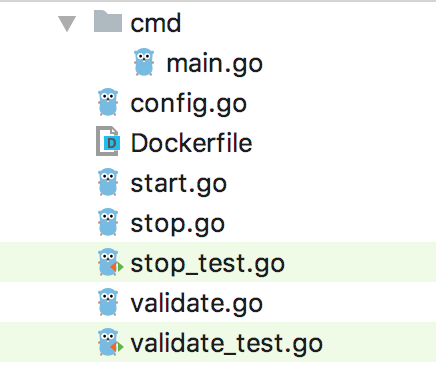

# Core Gateway Style

1. [Structure of code](#structure)
2. [Configuration](#configuration)
3. [Validate a configuration](#validate)
4. [Start a configuration](#start-config)
5. [Stop a configuration](#stop-config)
6. [Entrypoint](#entrypoint)

---
<h4>We are going to implement a gateway which listens to events from a fake event source</h4>

---

##  <a name="structure">Structure of code</a>

  

## <a name="configuration">Configuration</a>
Configuration for gateway is defined in `config.go` file. A configuration for gateway contains information about event source.

In case of our fake event source, a configuration will look like,

```go
    // FakeConfiguration contains topic information
    type FakeConfiguration struct {
        // Topic is the name of topic on which messages will be published
        Topic string `json: topic`
    }
```

Whenever there is a message published on the topic, the fake client will get an event.

Next thing we need is a struct that implement `ConfigExecutor` interface.

So what is a `ConfigExecutor` interface? It defines following methods that a gateway must implement and framwork will take care of the rest.

```go
type ConfigExecutor interface {
    // StartConfig starts a configuration
    StartConfig(configContext *ConfigContext)
    // StopConfig stops a configuration
    StopConfig(configContext *ConfigContext)
    // Validate validates a configuration
    Validate(configContext *ConfigContext) error
}
```

So, lets define a struct called `FakeConfigExecutor` that will implement `ConfigExecutor`

```go
type FakeConfigExecutor struct {
    *gateways.GatewayConfig
}
```

`gateways.GatewayConfig` is defined and exposed by framework and it contains information that all gateways need.

```go
// GatewayConfig provides a generic configuration for a gateway
type GatewayConfig struct {
    // Log provides fast and simple logger dedicated to JSON output
    Log zlog.Logger
    // Clientset is client for kubernetes API
    Clientset kubernetes.Interface
    // Name is gateway name
    Name string
    // Namespace is namespace for the gateway to run inside
    Namespace string
    // KubeConfig rest client config
    KubeConfig *rest.Config
    // gateway holds Gateway custom resource
    gw *v1alpha1.Gateway
    // gwClientset is gateway clientset
    gwcs gwclientset.Interface
    // transformerPort is gateway transformer port to dispatch event to
    transformerPort string
    // registeredConfigs stores information about current configurations that are running in the gateway
    registeredConfigs map[string]*ConfigContext
    // configName is name of configmap that contains run configuration/s for the gateway
    configName string
    // controllerInstanceId is instance ID of the gateway controller
    controllerInstanceID string
}

```

Next thing we need is to make sure we have a way to parse event source configuration. Lets define a `parseConfig` method

```go
func parseConfig(config string) (*FakeConfiguration, error) {
    var f *FakeConfiguration
    err := yaml.Unmarshal([]byte(config), &f)
    if err != nil {
        return nil, err
    }
    return f, err
}
```

So our `config.go` will look like follow,
```go

import (
    "github.com/argoproj/argo-events/gateways"
    "github.com/ghodss/yaml"
)

// FakeConfiguration contains topic information
type FakeConfiguration struct {
    // Topic is the name of topic on which messages will be published
    Topic string `json: topic`
}

// implements ConfigExecutor interface
type FakeConfigExecutor struct {
    *gateways.GatewayConfig
}

// parseConfig parses a event source configuration
func parseConfig(config string) (*FakeConfiguration, error) {
    var f *FakeConfiguration
    err := yaml.Unmarshal([]byte(config), &f)
    if err != nil {
        return nil, err
    }
    return f, err
}
```

## <a name="validate">Validate an event source configuration</a>
Validating an event source configuration in very important and implementation must make sure all necessary fields are set in a configuration.

Our `validate.go` file looks like follows,

```go
import (
    "fmt"
    "github.com/argoproj/argo-events/gateways"
)

// Validate validates a fake event source configuration
func (fce *FakeConfigExecutor) Validate(configContext *gateways.ConfigContext) error {
    fakeConfig, err := parseConfig(configContext.Data.Config)
    if err != nil {
		return gateways.ErrConfigParseFailed
    }
    if fakeConfig == nil {
        return gateways.ErrEmptyConfig
    }
    if fakeConfig.Topic == "" {
        return fmt.Errorf("%+v, topic can't be empty", gateways.ErrInvalidConfig)
    }
    return nil
}
```

## <a name="start-config">Start an event source configuration</a>
Now the fun part, lets implement the logic that consumes an event from event source and forwards event to sensor.

`start.go`:

```go
import (
    "fmt"
    "github.com/argoproj/argo-events/common"
    "github.com/argoproj/argo-events/gateways"
    "github.com/argoproj/argo-events/pkg/apis/gateway/v1alpha1"
    corev1 "k8s.io/api/core/v1"
    metav1 "k8s.io/apimachinery/pkg/apis/meta/v1"
    "k8s.io/client-go/kubernetes"
    "github.com/myfakeevents/fake"
)

// StartConfig runs a configuration
func (ce *FakeConfigExecutor) StartConfig(config *gateways.ConfigContext) {
    ce.GatewayConfig.Log.Info().Str("config-name", config.Data.Src).Msg("operating on configuration")
    // parse configuration passed by framework
    fakeConfig, err := parseConfig(config.Data.Config)
    if err != nil {
        // return error back to framework
        config.ErrChan <- gateways.ErrConfigParseFailed
        return
    }
    ce.GatewayConfig.Log.Info().Str("config-key", config.Data.Src).Interface("config-value", *fakeConfig).Msg("fake configuration")

    // lets listen to events
    go ce.listenToEvents(fakeConfig, config)

    for {
        select {
        // notification that confiuration became active and started consuming events
        case _, ok := <-config.StartChan:
            if ok {
                ce.GatewayConfig.Log.Info().Str("config-name", config.Data.Src).Msg("configuration is running")
                // used by framework
                config.Active = true
            }
            

        // process an event
        case data, ok := <-config.DataChan:
            if ok {
                // framework takes care of converting an event into CloudEvents specification compliant event and forwarding to sensors
                ce.GatewayConfig.DispatchEvent(&gateways.GatewayEvent{
                    Src:     config.Data.Src,
                    Payload: data,
                })
            }

        // configuration is stopped
        case <-config.StopChan:
            ce.GatewayConfig.Log.Info().Str("config-name", config.Data.Src).Msg("stopping configuration")
            // mark configuration as done
            config.DoneChan <- struct{}{}
            ce.GatewayConfig.Log.Info().Str("config-name", config.Data.Src).Msg("configuration stopped")
            return
        }
    }
}

// listenEvents listens to fake notifications
func (ce *FakeConfigExecutor) listenToEvents(fakeConfig *FakeConfiguration, config *gateways.ConfigContext) {
    // create a K8 event to let framework know that configuration is active
    event := ce.GatewayConfig.GetK8Event("configuration running", v1alpha1.NodePhaseRunning, config.Data)
    _, err = common.CreateK8Event(event, ce.GatewayConfig.Clientset)
    if err != nil {
    ce.GatewayConfig.Log.Error().Str("config-key", config.Data.Src).Err(err).Msg("failed to mark configuration as running")
    config.ErrChan <- err
        return
    }

    // configuration has started
    config.StartChan <- struct{}{}
    
    // consume events using fake client
    for {
        select {
            case notification := <-fake.ListenEvent(fakeConfig.Topic):
                config.DataChan <- notification
            case <-config.DoneChan:
                // shutdown this configuration
                ce.GatewayConfig.Log.Info().Str("config-name", config.Data.Src).Msg("configuration shutdown")
                config.ShutdownChan <- struct{}{}
                return
        }
    }

}
```

## <a name="stop-config">Stop a configuration</a>

`stop.go`:

```go
import "github.com/argoproj/argo-events/gateways"

// StopConfig stops the configuration
func (fce *FakeConfigExecutor) StopConfig(config *gateways.ConfigContext) {
    if config.Active == true {
        config.Active = false
        config.StopChan <- struct{}{}
    }
}
```

## <a name="entrypoint">Entrypoint</a>
We need `main` function to start gateway, 

`cmd/main.go`:

```go

package main

import (
	"github.com/argoproj/argo-events/gateways"
	"github.com/argoproj/argo-events/gateways/custom/fake"
)

func main() {
    gc := gateways.NewGatewayConfiguration()
    ce := &fake.FakeConfigExecutor{}
    ce.GatewayConfig = gc
    gc.StartGateway(ce)
}

```